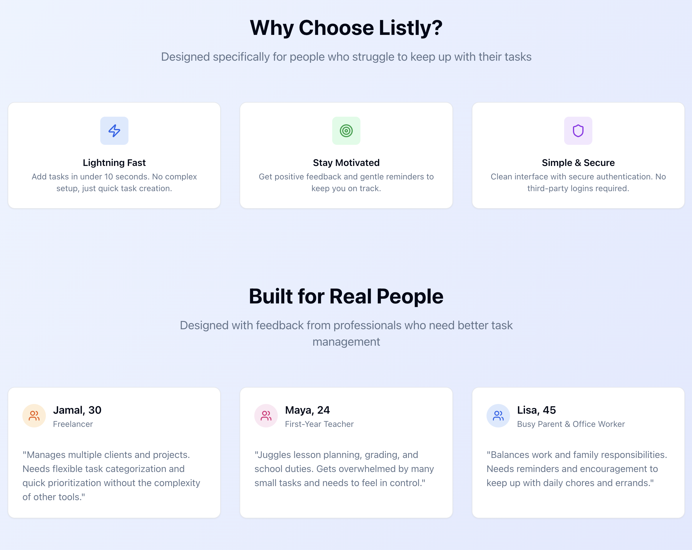
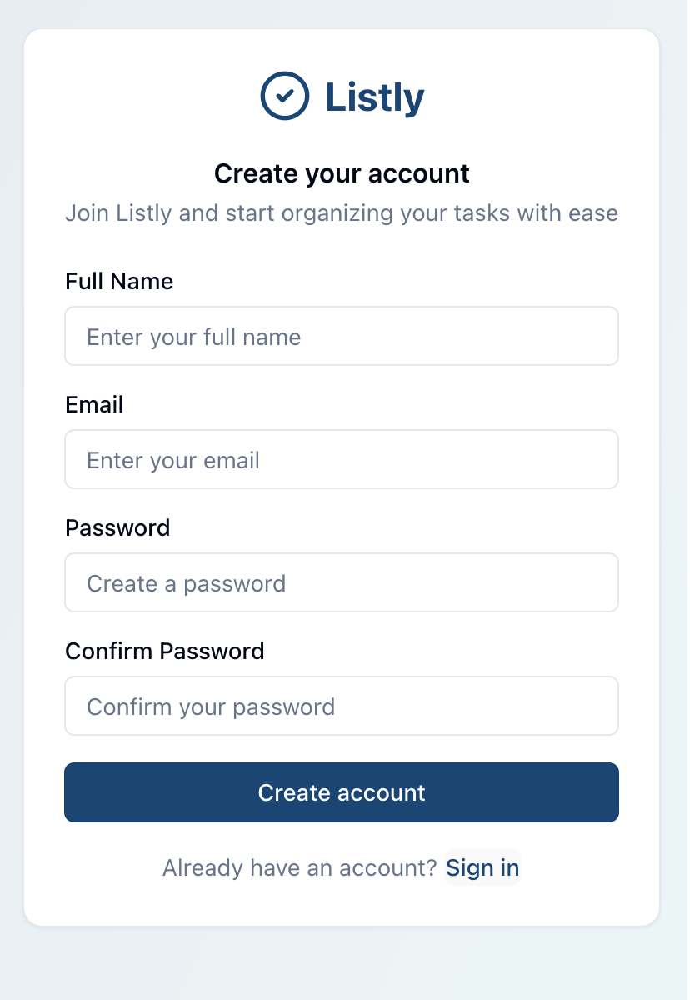

# Listly: A Modern Todo Application

## Project Introduction

Listly is a beautifully designed, full-stack todo application built to showcase a modern web development workflow. It features a sleek, user-friendly interface and a robust backend, making it an ideal project to demonstrate practical coding skills to potential employers.

This project was built to [**Please add a brief description of why you built this project**] and is intended for [**Please describe the target audience for this project**].


## Screenshots

<details>
  <summary><strong>Show/Hide More Screenshots</strong></summary>


  <p align="center">
    
  </p>
  <p align="center">
    
  </p>
  <p align="center">
    
  </p>
  <p align="center">
    
  </p>

  <!-- Add more screenshots as needed -->
</details>

## Deployment Link

[**Please add a link to your deployed project or a video demo.**]

## Additional Links

- **Wireframes**: [**Link to your wireframes (e.g., Figma, Balsamiq)**]
- **Entity-Relationship Diagram (ERD)**: [**Link or image of your ERD**]
- **Project Proposal**: [**Link to your project proposal document, if available**]

## Tech Stack

### Frontend

- **Framework**: React
- **Language**: TypeScript
- **Styling**: Tailwind CSS
- **UI Components**: Shadcn UI
- **Routing**: React Router
- **Build Tool**: Vite

### Backend

- **Framework**: Express.js
- **Language**: TypeScript
- **API**: RESTful
- **Authentication**: JWT (JSON Web Tokens)

## Project Set Up Instructions

To get a local copy up and running, follow these simple steps.

### Prerequisites

- npm
  ```sh
  npm install npm@latest -g
  ```

### Frontend

1. Clone the repo
   ```sh
   git clone https://github.com/your_username/listly-todo-app.git
   ```
2. Navigate to the frontend directory
   ```sh
   cd listly-todo-app/frontend
   ```
3. Install NPM packages
   ```sh
   npm install
   ```
4. Start the development server
   ```sh
   npm run dev
   ```

### Backend

1. Navigate to the backend directory
   ```sh
   cd ../backend
   ```
2. Install NPM packages
   ```sh
   npm install
   ```
3. Start the server
   ```sh
   npm run dev
   ```

## Contribution Instructions

Contributions are what make the open-source community such an amazing place to learn, inspire, and create. Any contributions you make are **greatly appreciated**.

If you have a suggestion that would make this better, please fork the repo and create a pull request. You can also simply open an issue with the tag "enhancement".

1. Fork the Project
2. Create your Feature Branch (`git checkout -b feature/AmazingFeature`)
3. Commit your Changes (`git commit -m 'Add some AmazingFeature'`)
4. Push to the Branch (`git push origin feature/AmazingFeature`)
5. Open a Pull Request

Don't forget to star the project! Thanks again!

## Development Workflow

### Branching & Pull Requests

- **Never push directly to `main`**. All work should be done on separate branches.
- Create a pull request (PR) to merge your changes into `main`.
- Ensure PRs are reviewed by at least one other person before merging.

### Commit Messages

- Write thoughtful and descriptive commit messages.
- Start your commit messages with a relevant prefix, such as:
  - `feat`: A new feature
  - `style`: CSS or styling changes
  - `update`: A non-breaking change
  - `fix`: A bug fix
  - `delete`: Removing code or files

### Documentation

- Use inline comments to clarify complex parts of your code.
- Remove all commented-out code before committing.
- Ensure all functions and files have clear, concise descriptions.

### Project Management

- Keep the project's scrum board (e.g., Trello, Jira, GitHub Projects) up-to-date.
- Write specific and descriptive cards for all tasks.
- PR descriptions should be detailed, outlining the changes made and referencing the corresponding task on the scrum board. 
